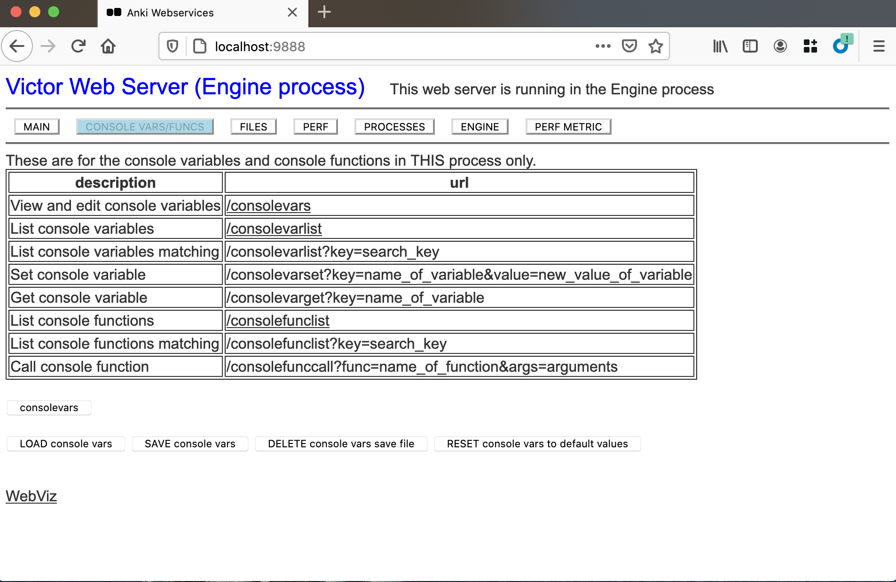
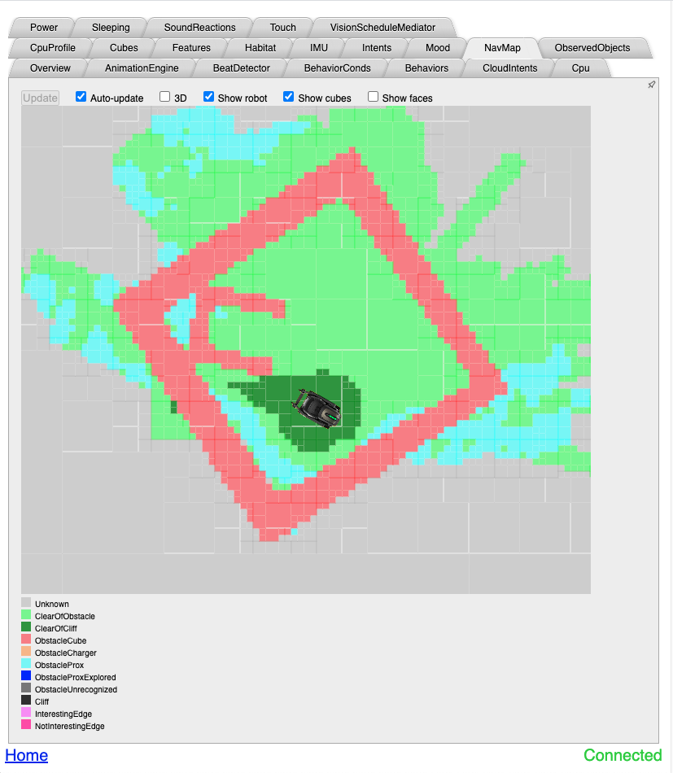

# Tools

## Vector Self Test

Unlocking Vector adds a developer self test option to the admin menu
that can be used to check all the various hardware. To access it:

1. Put Vector in its charging station.

2. Press his backpack button twice.

3. Move the forklift up and down to get to the admin menu.

4. Remove Vector from the charger, rotate his tank treads until the
    **>** arrow points to `RUN SELF TEST`.

5. Move the forklift up and down to select.

6. Move the tank treads to select `CONFIRM` and move the forklift up
   and down to begin.

Follow the instructions on screen as Vector performs the self test.

## SSH / Shell Access

SSH is so integral to development that you might not think of it as a
tool. But it acts as the gateway that allows access to all of Vector's
internals. Without SSH you could not:

* Initiate console access to run commands.
* Modify files locally on Vector.
* Copy new files, features and enhancements, to Vector.

After obtaining the SSH key as detailed in the **Unlocking Your
Robot** chapter you'll need to:

1. Load the key on your system if its not loaded. You will normally
    need to do this once after powering on your computer:
    `ssh-add ~/.ssh/id_rsa_Vector-X1Y1`

2. Obtain Vector's Internet Address from the Admin Screen. This will
   normally stay the same as long as you're on the same network but
   may change. If you suddenly can't connect re-check it.

   * Put vector in its charging station.
   * Press the backpack button twice to get to the Pairing screen.
   * Raise the forklift up and down to get to the Admin screen.
   * Get the address listed after IP.

    Throughout this document we will use `<ROBOT_IP>` as a placeholder
    for this address. Wherever you see that replace it with this address.

3. SSH in to Vector: `ssh root@<ROBOT_IP>`

At this point you will be logged in to a Unix Shell. Once again the
shell is so integral to development many developer don't think of it
as a tool. But if you've never used it before there are many
eccentricities you need to learn to be able to use the shell
successfully. It will make your life much easier if you go through a
tutorial online to get up to speed on basic usage.

## Compilers

ARM compiiler

For 
https://anki-vic-pubfiles.anki.com/license/prod/1.0.0/licences/OStarball.v160.tgz

The
https://anki-vic-pubfiles.anki.com/license/prod/1.0.0/licences/engineTarball.v160.tgz


## Text editors

To edit configuration files, change settings, etc, you'll find
yourself using a text editor to perform a variety of tasks. The
following text editors are installed by default. If you don't know
which one to use you probably want to start with **nano**.

* **nano** - The recommended editor for most users. Provides basic
    instructions on the screen.

* **vi** - A very low resource editor that operates in modal mode that
    is confusing to beginners. However it is available on the most
    minimal of server and embedded installs. It is useful to know the
    basics of vi as it will be installed on systems with no other editors.
	
* **mg** - A low footprint editor that mimics the basic keystrokes and
    operations of the popular text editor emacs.
	
* **emacs** - Is not installed but aliased to the mg program for
    people who keep typing `emacs` out of muscle memory.

## logcat

Since Vector runs a variant of the Android operating system we have
access to all the standard Android tools. These are a little different
than the standard linux tools. One very important one is
`logcat`. This is the system used to look at all the logs being
generated by various components. This includes both low level system
events and high level events logged by the software controlling
Vector.

To view a stream of logging in real time:

```
ssh root@<ROBOT_IP>
logcat
```
However there is so much information being logged it can be difficult
to see what you want. You'll need to know two things to filter logs
effectively.

First there are options to filter that are in line with a typical
debugging hierarchy. You can choose a log level and only see errors
that are as or more sever than the chosen log level.  For example
`logcat *:W` will filter out *Debug* and *Info* level messages.

You also have the opportunity to use LNAV, a log viewing program, with
Vector's logs using custom filters that will allow you to more effectively
debug Vector. Check that out [here](https://github.com/digital-dream-labs/lnav-configuration).

* **D**ebug
* **I**information
* **W**arning
* **E**rror
* **F**atal
* **S**uppress all messages.

There is also a subsystem encoded in the logcat output. In the
following example we have the subsystems *rampost*, *vic-robot*,
*vic-anim*, *vic-switchboard*, *update-engine*, *vic-cloud* and *chronyd*.

```
10-09 01:58:47.525  1927  1927 I rampost : @rampost.rampost.exit000005123
10-09 01:58:48.111  1969  1969 I vic-robot: @hal.body_versionfe3d1101ffffffffffffffffffffffff577330303030303030333435613163009af999d6117621
10-09 01:58:49.751  2039  2039 I vic-anim: @random_generator.seedAnimContext266417959619261
10-09 01:58:50.345  2156  2156 I vic-switchboard: @switchboard.hellohello215619854
10-09 01:58:55.172  2278  2278 I update-engine: @robot.ota_download_start000024678
10-09 01:58:55.541  2129  2169 I vic-cloud: @profile_id.start2myn3gMaZqYFjTgw9pkmnTB25051
10-09 01:59:03.799  1798  1798 I chronyd : @ntp.timesync31491
```

We can control the level of an individual subsystem and use the
wildcard * to control anything that doesn't match the other
parameters:

* `logcat vic-anim:* *:S` show everything for vic-anim only.

*  `logcat vic-cloud:I vic-anim:I *:E` show info for vic-anim and
    vic-cloud and any error we see.

Just watching the logs flow by while Vector is in operation can start
to give you a better idea of what the systems are doing.

## Development Web Servers

The more important Vector subsystems come with embedded webservers for
development that do not run on Production Vectors. The interfaces are
designed for internal use and aren't the prettiest but they provide a
wealth of information about Vector.

These are enabled on OSKR Vectors, but fire-walled off by default as
they allow low-level control of the Vector. There are a few ways to
remove the firewall but the quickest is ssh port forwarding. Start a
session with port forwarding to get access to the web servers:

```
ssh -L 8887:localhost:8887 -L 8888:localhost:8888 -L 8889:localhost:8889 root@192.168.1.110
```

And now in your computer's web browser go to <http://localhost:8888>
to access the webserver embedded in `vic-engine`. You should see this:



There are **a lot** of things you can see here and you're encouraged to
poke around. For now we'll provide a brief overview of the two main
systems.

### Console variables and functions

On the first screen you will see several options referring to
**Console Variables**. These are used to provide various flags to
change behavior of Vector, gather information, and more.

There are many many options here. Most of the options are known
internally in the codebase as **Dev Cheats** and are not available 
on production versions of Vector software.

To get the full list of variables visit
<http://localhost:8888/consolevarlist>. To get the full list of
functions visit <http://localhost:8888/consolefunclist>. Examples of
changing a console variable value and executing a console function can
be found in the Examples section of this manual.

### WebViz

WebViz provides insight in to the way Vector is operating at a high
level in real time. Among other things it will show you:

* **NavMap** Vector's understanding of the enviroment around him,
   where table edges are located, walls, charger, obstacles.

* **CloudIntents** How Vector turns what you say into an action on its
   part.

* **Mood** Is Vector Happy? Confident? Social?
  Stimulated? Trusting?

* **Behavior** What is Vector doing now and why?

There is a link for WebViz at the bottom of the main webserver
page. It can also be accessed directly at
<http://localhost:8888/webViz.html>. Explore around and see what you
can learn.

#### WebViz Navigation. Vector knows it's in a Vector Space


