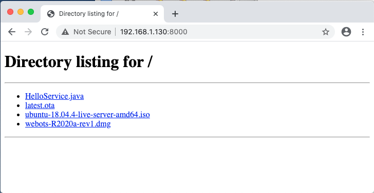
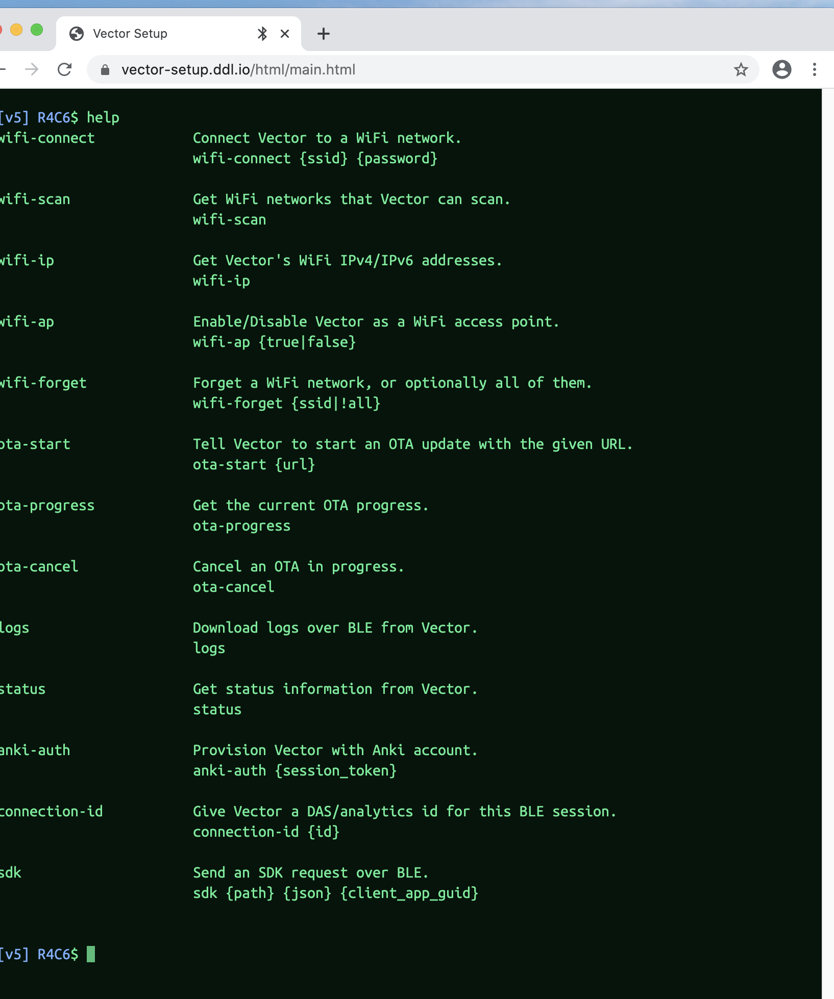
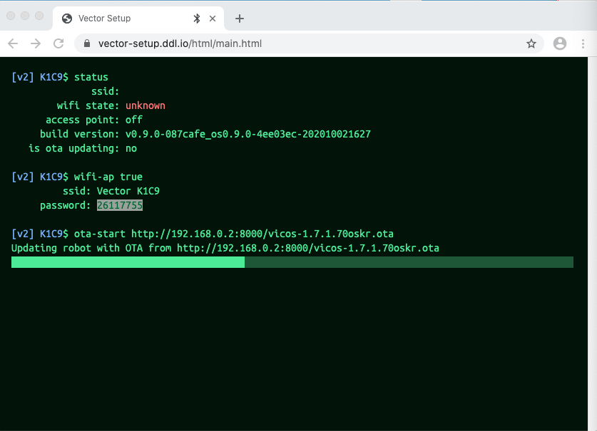

# Detailed Unlock Steps
## Step 1: Getting your QSN

The first step in unlocking your Vector is delivering the QSN to Digital Dream
Labs so we can make your custom unlock image. This is a serial number
that is included internally on the unit that is different from the ESN
which you see printed on the bottom of the robot.

To get the QSN:

1. Using the Chrome web browser go to <https://vector-setup.ddl.io>

2. Follow the instructions to pair with Vector and log in.

3. Click the **Download Logs** link located at the top right corner of
    the page.

4. Open the downloaded archive which should extract the contents of
    several logs on to your hard drive.

5. Open the file `factory/log1`. It should look like this:

    ```
    total 13
    dr--r-----    3 888      888           1024 Jan  1  1970 .
    drwxr-xr-x    4 root     root          1024 Jan  1 00:00 ..
    dr--r-----    2 888      888           1024 Jan  1  1970 007084d8
    -r--r-----    1 888      888           1472 Jan  1  1970 AnkiRobotDeviceCert.pem
    -r--r-----    1 888      888           1704 Jan  1  1970 AnkiRobotDeviceKeys.pem
    -r--r-----    1 888      888            792 Jan  1  1970 Info007084d8.json
    QSN=324416252 # ESN=007084d8
    ```

6. Deliver the QSN and ESN from the last line of the file to Digital
    Dream Labs.

If you have trouble extracting the archive you can send the entire
.tar.bz2 file to Digital Dream Labs.

## Step 2: Doing a Test Upgrade

It is **strongly recommended** that you do a test upgrade with a safe
upgrade file before unlocking your robot. If the process is confusing
the first time it's recommended you do a test upgrade again and again
until you feel comfortable with the process.

Remember that modifying the ABOOT and recovery filesystems are
dangerous operations. If the process is interrupted somehow while
system files are installing it will make it impossible to boot
Vector. Some potential points of failure in a normal OTA upgrade are:

* Vector loses power in the middle of the upgrade.

* Your wifi modem breaks or is unplugged in the process.

* Your service providers connection dies in the middle of the OTA file download.

* Some random part of the internet has issues preventing the OTA from  
downloading completely.

This doesn't matter for normal OTA installs because the process is
designed to be safe and we can always fall back to the recovery
software. But when unlocking we are **REWRITING** the recovery
software. An interruption like this can be
disastrous.

To minimize chances of network problems interfering with the update
process the recommended procedure is serve your unlock image from your
computer to Vector locally. This eliminates any possibility of Wide
Area Network issues affecting the outcome.

The process is not particularly complex if you follow the steps as
written but it can be confusing the first time you do it, particularly
if you don't have much experience with networking. Luckily you can
practice by uploading a normal system upgrade manually. This is *safe*
and can be repeated safely.

### Hosting the OTA locally

We need to host the OTA locally on your computer we're using to update
since there will be no access to anything else at that point in time.

1. Download a local copy of the latest production firmware from
<http://ota.global.anki-services.com/vic/prod/full/latest.ota>.

2. Create a simple webserver to serve up the files. Here we use
   python because it is installed on many systems and has a
   lightweight webserver built in. However there is nothing special
   about python here so you may substitute with a webserver you're
   more familiar with

    Assuming you saved the file in a Downloads folder:

    ```
    cd ~/Downloads # or other directory
	python3 -m http.server
    ```
	
    Or if you don't have python3 installed:
	
    ```
    cd ~/Downloads # or other directory
	python -m SimpleHTTPServer
    ```

3. Determine the LAN IP of your computer. This is different from the
   external address and will generally start with 192.168, or 10.0. If  
   you don't know how to find the address
   [this LifeHacker article](https://lifehacker.com/how-to-find-your-local-and-external-ip-address-5833108) might help.

4. Open the Chrome Browser and verify that you can get to the file. If
   your computer's IP address is 192.168.1.130, the link is
   <http://192.168.1.130:8000/>

    You should see a basic index page listing files including latest.ota.

    

5. Click on the `latest.ota` file and verify that the link works and
   your browser asks you to download the file.


### Prepping the robot

First, fully charge your Vector. Keep him on the charging dock. Next
wipe the user data from Vector and enter into Recovery Mode.

#### Erasing User Data

First wipe the user data from Vector. This will erase the entire contents of
the `/data` partition. It will also give the Vector a new identity and name later.

To do so:

1. Place Vector on its charging station.

2. Press his backpack button twice. The normal BLE Pairing screen
    should appear on its screen.

3. Lift Vector's forklift up and down. A administration menu should
    appear on its screen.

4. Remove Vector from its charging station and spin one of the tank
    treads. This will move the **>** arrow pointing at an option.

5. Select **CLEAR USER DATA**. Lift the forklift up and down to
    proceed. A confirmation screen should appear.

6. Spin the tank treads to select **CONFIRM**. Lift the forklift up
    and down. Vector should reboot and start at the initial setup screen.

7. You will now need to re-attach Vector to your account via the Phone
    App or other means and re-download the newly generated SSH key if
    you wish to SSH in to Vector.

#### Recovery Mode (aka Factory Reset)

Next perform Recovery Mode reboot (Factory Reset) of your Vector. 
This will cause Vector to reboot and run using the the initial factory recovery  
filesystem.

To do so:

1. Place Vector on its charging station.

2. Hold its backpack button down until it powers down completely and  
keep holding down until the white light at the back of the backpack  
comes on.

4. Vector will reboot and start at the initial setup screen just like new.


### Connecting to the advanced console interface in Vector Web Setup

We will use the simulated terminal interface in Vector Web Setup to access
advanced options that aren't available in the normal interface.

1. Open a new tab in Chrome and go to <https://vector-setup.ddl.io>

2. Place Vector in its charging station and press the backpack button  
twice to enter pairing mode.

3. Click "Pair with Vector" and select Vector from the popup.

4. You're now on the screen to enter the pairing code. Uncheck the box  
for **Enable auto-setup flow**. Enter the pin and click **Enter PIN**.

5. You will now be in an emulated terminal session in chrome. Type  
`help` to verify it's working.  

Keep this console open throughout the process.  



6. In the emulated terminal session, `wifi-scan` to check that Vector can see your wifi

7. Have Vector connect to your wifi with `wifi-connect ` followed by your Wifi SSID and password

### Starting the deploy

This is the critical step. We want to do this correctly.

1. Go back to your tab with the file directory listing. Since Vector
will be requesting the file **DO NOT** use links with `localhost` in
them or it won't be able to find the files.

2. Copy the full link for `latest.ota` to your clipboard.

3. Return to the Chrome window with the Terminal session and run
    `ota-start <PASTED LINK FROM ABOVE>`

If all goes well you should see a status bar update, the file should
upload, Vector will reboot, and you'll have the new version of the
firmware.

If it doesn't go well you may get an error status code in the
window. Some of the more common status codes are:

* **203** Vector couldn't find the file. You either had the wrong
    link, such as using `localhost` or you don't have a webserver running.

* **216** Downgrade not allowed. You didn't do a factory reset.

## Step 3: Installing the unlock image

This is the critical step. We want to do this correctly.

Now we follow the same procedure with the custom generated image for
your Vector. If you skipped ahead to here *please* go through the test
run with a safe file. Assuming you know what you're doing:

1. Start from an updated vector with updated software. The 0.9.0
    recovery software does not support updating the appropriate
    partitions and it will fail to try to install the unlock image.

    Don't worry, it does this safely and you will not damage your
    Vector if you forget to do so.

2. Put a book or heavy block in front of Vector to keep him from driving
   off the charging station while updating.

3.  Use the link to the custom image provided by Digital Dream Labs
    instead of the normal OTA file. Note that each custom image only
    works on ONE Vector. If you have multiple Vectors each will need
    its own image.  Vector's face probably won't show any indication
    that an update is in process -- he will show his eyes rather than
    a cloud with a spinner.

After installation is complete Vector should reboot and you should now
see an introductory screen that says OSKR. This means that your
Vector is working and has the new security keys needed for OSKR
development.

We're out of danger now.

## Step 4: Installing the latest OSKR image

Next we need to install an up-to-date software image to bring back all
the expected functionality. This is a **safe** update again. If there
are problems the Vector will continue to run. No need to be paranoid
on this update.

Get the file
<http://ota.global.anki-services.com/vic/oskr/full/latest.ota> and
apply it to Vector the same way you applied the test upgrade.
**Please Note: This is NOT the same "latest.ota" you downloaded earlier! Please download this new file and either rename it or store it elsewhere to differentiate the OSKR image from the production image you downloaded earlier.**

## Sign in to Vector

You may use either the normal phone app or
<https://vector-setup.ddl.io>  to add your account to the
newly imaged Vector.

## Step 5: Getting your SSH key

Now that Vector is up and running and back to his normal self you'll
want to get the newly created SSH key. Although this isn't strictly
part of the unlock process this key is needed to access Vector's
internals and begin your OSKR adventure! So lets grab it now.

To get the QSN:

1. Using the Chrome web browser go to <https://vector-setup.ddl.io>

2. Follow the instructions to pair with Vector and log in.

3. Click the **Download Logs** link located at the top right corner of
    the page.

4. Open the downloaded archive which should extract the contents of
    several logs on to your hard drive.

5.  The file `data/ssh/id_rsa` is your security key. It  
should be installed so it can be used by your system. On Linux and  
OSX:

    ```bash
    cp data/ssh/id_rsa_Victor-X1Y1 ~/.ssh
    chmod 700 ~/.ssh/id_rsa_Victor-X1Y1
	```

    For Windows 10 users:
    ```bash
    Set-Service -Name ssh-agent -StartupType Manual
    Start-Service ssh-agent
    ssh-add id_rsa_Vector-whatever
    ssh root@192.168.whatever```
    
6. Load the key in to your keyring: `ssh-add
    ~/.ssh/id_rsa_Victor-X1Y1`

7. Obtain the IP of the robot from the diagnostics screen.

    * put Vector in charger.
    * double click the backpack button.
	* raise the forklift up and down

    You should now see the diagnostics screen which has the IP.

8. Connect! `ssh root@<ROBOT_IP_FROM_ABOVE>`

9. Type the command `exit` to leave the SSH session.

## Congratulations! Vector is unlocked!

## Advanced Network Configuration: Enabling AP mode

If you have a particularly bad router or wifi connection it's best to
find a better connection to kick off the upgrade. However it is
possible to eliminate your router as a dependency and talk directly to
Vector by turning it in to an Access Point. The downside to this is
that you will lose all normal internet access and only be able to
talk to Vector until the process is complete.

This usually provides a better more reliable connection but some
computers' network cards may have more trouble than not connecting to
Vector's 2.4 Ghz network. Once again it is **strongly recommended**
that you test an AP style deploy with the safe upgrade image as listed
in Step 2 above.

Follow the process until bring up the simulated command terminal. From
there:


1. Issue the command `wifi-ap true`. This will display new credentials
    for the new wifi connection.

    ```
    [v5] P7Z4$
    wifi-ap true
             ssid: Vector P7Z4
       password: 20809135
    ```

2. Connect your computer to this access point with this password.

3. Test that you can access the file index at
   <http://192.168.0.2:8000> which will be your new Local IP while
   connected to Vector.

4. Resume the existing process while still on the access point.

If all goes well Vector will install and reboot, and your computer
will automatically go back to its normal network.


